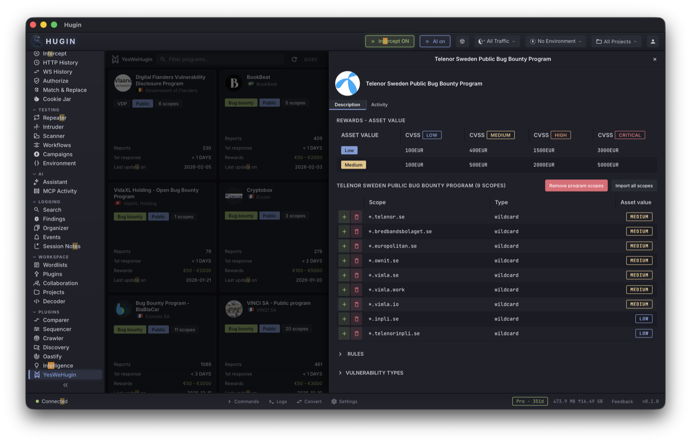

# YesWeHugin

YesWeHugin is a native YesWeHack integration that lets you browse bug bounty programs, import scope directly into Hugin, and submit vulnerability reports -- all without leaving the application.

## Setup

YesWeHugin supports two authentication methods:

### Personal Access Token (PAT)

The simplest method. Generate a token from your YesWeHack account (MyYesWeHack > Create Token), then enter it in **Settings > Integrations > YesWeHack**.

With a PAT configured, YesWeHugin loads all programs you have access to, including private invitations.

### JWT Login

For full API access including report submission, YesWeHugin supports direct JWT authentication via email and password. If your account has 2FA enabled, configure your TOTP secret for automatic code generation.

Without any authentication, YesWeHugin still loads public programs -- useful for discovering new targets.

## Browsing Programs

The main view shows a card grid of all available programs. Each card displays:

- Program name and company
- Country flag
- Bounty range (min/max rewards)
- Program status (open, private, etc.)

Use the search bar to filter programs by name. Click any program card to open the detail panel.

## Program Detail

The slide-over detail panel has multiple tabs:

### Description

The full program description rendered from Markdown, including scope, rules of engagement, and reward tables.

### Scope

A table listing all in-scope and out-of-scope assets. Each scope entry shows:

- Asset URL or identifier
- Asset type (web, mobile, API, etc.)
- Asset value rating

**Import Scope** -- click the import button on any scope entry to add it directly to Hugin's proxy scope configuration. This sets up host patterns so the proxy captures only traffic relevant to the program. The toolbar shows how many scope entries are currently active.

### Rules

Expandable sections for program rules, qualifying vulnerability types, hunting guidelines, collaboration rules, and out-of-scope items.

### Activity

Two sub-sections:

- **Hacktivity** -- recent public reports for the program with pagination. Shows report titles, severity, bounty amounts, and submission dates.
- **Hall of Fame** -- top researchers ranked by points for the program.

## Submitting Reports

Click **New Report** to open the report form. The form includes:

- **Title** -- short vulnerability description
- **Description** -- Markdown editor with a pre-populated template (Description, Exploitation, PoC, Risk, Remediation sections). Toggle between Write and Preview modes.
- **Bug Type** -- select from the program's qualifying vulnerability types (100+ CWE-mapped categories)
- **Scope Asset** -- which in-scope asset is affected
- **Endpoint** -- the specific URL or path
- **Vulnerable Part** -- the parameter, header, or component
- **Payload** -- the exploit payload used
- **Technical Environment** -- browser, OS, tools used
- **CVE** -- associated CVE if known
- **Impact** -- select from impact categories (Account Takeover, RCE, Data Exposure, etc.)

### CVSS Calculator

A built-in CVSS 3.1 calculator computes the base score from metric dropdowns (Attack Vector, Attack Complexity, Privileges Required, User Interaction, Scope, Confidentiality/Integrity/Availability Impact). The vector string and numeric score update in real time as you change metrics.

### Attachments

Upload evidence files (screenshots, PoC scripts, HTTP captures) directly to the YesWeHack report. Attachments are uploaded via the YWH API and linked by reference ID.

### Bug Chain

Link reports together when vulnerabilities form an exploit chain. Enable the chain toggle and enter the reference ID of the related report.

### Source IPs

Declare the IP addresses used during testing. A fetch button auto-detects your current public IP.

### Submit

Click Submit to send the report directly to YesWeHack via their API. The report appears in your YesWeHack dashboard immediately.

## Draft Management

Reports can be saved locally as drafts before submission. Drafts are stored in `~/.hugin/yeswehack/drafts/` and persist across sessions.

## MCP Tool

**`yeswehack`** -- YesWeHack platform integration.

**Authentication:**

- `auth_status` -- check current authentication state (JWT, PAT, or none)
- `auth_jwt_login` -- authenticate with email/password (+ TOTP if configured)
- `auth_jwt_refresh` -- refresh an expired JWT token
- `auth_set_totp_secret` -- store TOTP secret for automatic 2FA

**Reports:**

- `report_create` -- create a new report draft locally
- `report_list` -- list all local report drafts
- `report_get` -- get a specific draft by ID
- `report_update` -- update draft fields
- `report_delete` -- delete a draft
- `report_attach` -- attach a file to a report
- `report_submit` -- submit a report to YesWeHack
- `report_sync` -- sync report status from YesWeHack
- `draft_upload` -- upload a draft with attachments

**Utilities:**

- `cvss_calculate` -- compute CVSS 3.1 base score from metrics
- `templates` -- list available report templates
- `scope_to_scan` -- convert a program's scope entries into scanner targets

## Integration with Hugin Workflow

YesWeHugin fits naturally into the Hugin testing workflow:

1. **Browse** programs in YesWeHugin, find a target.
2. **Import scope** with one click -- Hugin's proxy now captures only relevant traffic.
3. **Test** using the proxy, scanner, intruder, and other tools.
4. **Document** findings in the Findings tab.
5. **Report** directly from YesWeHugin with the built-in CVSS calculator and Markdown editor.

No context switching between Hugin and the YesWeHack web interface.
